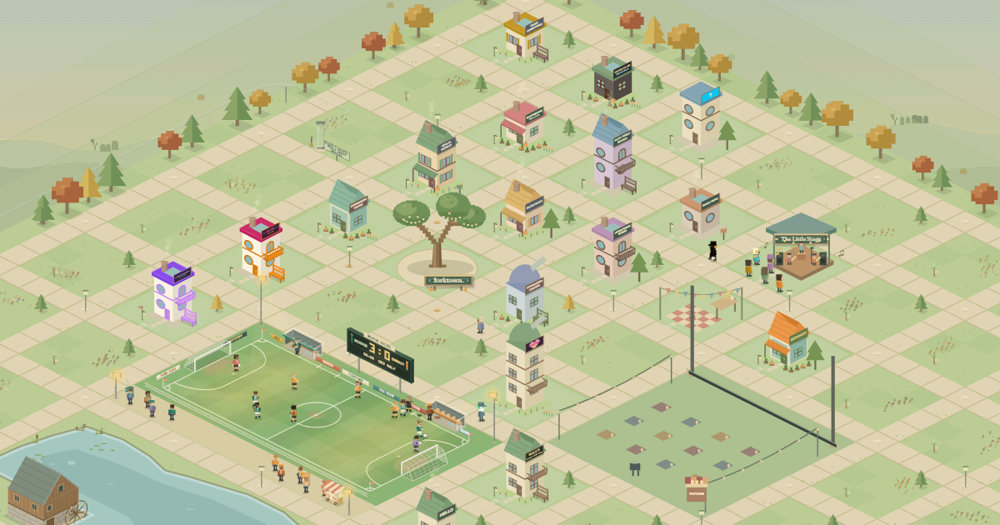

# Forktown 🌱

**A little town, built one pull request at a time.** Design a home and a neighbor; contribute one JSON file. Every house hangs a lantern on the Lantern Fork.

[Visit the town](https://renanbazinin.github.io/forktown/) · [Detailed contributor guide](CONTRIBUTING.md)



## 1. Start in the live town

Open the [live site](https://renanbazinin.github.io/forktown/) and click **Find your way in**. You’ll see **Fork on GitHub**:


**Why can’t I build here?** The published town is read-only. It can show houses and their JSON, but cannot save files to your computer’s project. Building happens in your local copy; a reviewed pull request brings your house to the shared town.

## 2. Fork it and run it locally

You’ll need a GitHub account, Git, and Node.js 24 (22.12+ also works). No API keys or database setup.

Click [Fork on GitHub](https://github.com/renanbazinin/forktown/fork), then **Create fork**. In a terminal, replace `YOUR_USERNAME` below with your GitHub username and paste:

```sh
git clone https://github.com/YOUR_USERNAME/forktown.git
cd forktown
git switch -c add-my-place
npm ci
npm run dev
```

Leave that terminal running. Open [localhost:5173](http://localhost:5173) and click **Find your way in**. Now the button says **Build a place**:


> Still seeing **Fork on GitHub**? Check that you opened localhost and started `npm run dev`. The live site and `npm run preview` do not enable the builder.

## 3. Make it yours

Click **Build a place**. Enter your real GitHub username, then customize **Home**, **Neighbor**, and **Outdoor sign**. Scroll down to choose an open plot, add a story, and check your **File id**.


Names and plots in these screenshots are examples. **One new house + one neighbor per pull request.** Choosing a plot does not reserve it.

## 4. Save your house

Choose **Continue to save**, then **Save to my project** (scroll down if needed).


This creates `places/YOUR_FILE_ID.json` and adds the house to your local town. Click **See my saved JSON** to review it, or **See my place in town** to visit. Saving locally does not publish it.

## 5. Send your pull request

Open a second terminal in your `forktown` folder and check your work:

```sh
npm run check
```

Once it passes, replace `YOUR_FILE_ID` with the file id from the builder and run:

```sh
git add places/YOUR_FILE_ID.json
git --no-pager diff --cached
git commit -m "Add my place to Forktown"
git push -u origin add-my-place
```

On your GitHub fork, click **Compare & pull request**. Target **renanbazinin/forktown → main**, check that only your new house file is included, complete the checklist, and click **Create pull request**.

After checks, maintainer review, merge, and deployment, your house appears in the [live town](https://renanbazinin.github.io/forktown/). If changes are requested, commit and push them on the same branch to update that pull request.

## About Forktown

Forktown makes a first open-source contribution something you can visit. Each contributed house brings a neighbor, a story, and its creator’s credit into a shared pixel town.

The town has a life of its own: neighbors take walks, meet at concerts, watch films, and stop by football matches. A full day and night lasts 24 real minutes, and each season about 11 hours: blossom, fireflies, turning leaves, then snow. Explore at your own pace, follow a resident, or enjoy the [live view](https://renanbazinin.github.io/forktown/live/).

Want to help beyond building a house? Improve the guides, report a bug, or contribute to the town itself. The [project guide](docs/PROJECT_GUIDE.md) covers features, code structure, and development commands.

---

[JSON fields & contribution rules](CONTRIBUTING.md) · [Features, project map & commands](docs/PROJECT_GUIDE.md) · [Architecture](docs/ARCHITECTURE.md) · [Publishing](docs/PUBLISHING.md) · [Live view](docs/LIVE.md) · [Roadmap](docs/ROADMAP.md)

[Code of conduct](CODE_OF_CONDUCT.md) · [MIT license](LICENSE)
